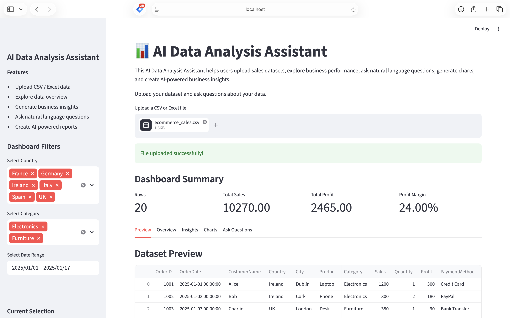
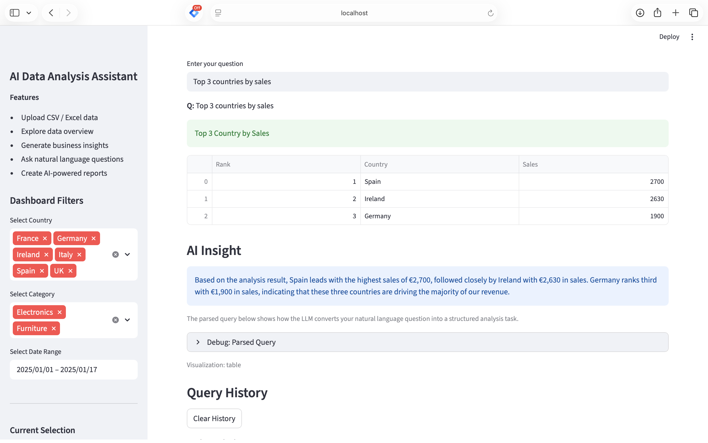
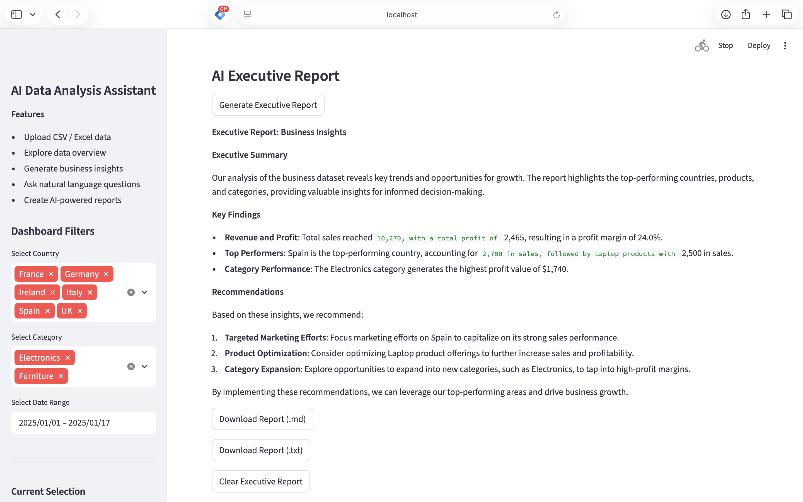

# AI Data Analysis Assistant

🚀 Live Demo:
https://ai-data-analysis-assistant-nqxrmeyyxdmhhlndnjwzr6.streamlit.app/

📂 GitHub Repository:
https://github.com/zhipenglinpro-project/AI-Data-Analysis-Assistant

## Application Preview

### Dashboard



### Natural Language Analysis



### AI Executive Report



# AI Data Analysis Assistant

An AI-powered data analysis application built with Streamlit, Pandas, Plotly, and Ollama.

Users can upload datasets, explore business performance, ask natural language questions, generate visualizations, and create AI-powered business reports.

---

## Features

### Data Processing

- Upload CSV and Excel files
- Data validation and cleaning
- Data profiling and overview

### Business Analytics

- Sales analysis
- Profit analysis
- Ranking analysis
- Trend analysis
- Filtered analysis

### AI Features

- Natural language query understanding
- Structured query generation using LLM
- AI-generated business insights
- AI executive report generation
- Multi-turn context support

Note: The full AI features use Ollama with llama3.2 locally.  
The cloud demo includes a rule-based fallback when Ollama is not available.

### Visualization

- Interactive Plotly charts
- Ranking tables
- KPI dashboard
- Sidebar filters

---

## Tech Stack

### Frontend

- Streamlit

### Data Processing

- Pandas
- NumPy

### Visualization

- Plotly

### AI

- Ollama
- Llama 3.2

### Language

- Python

---

## System Architecture

User Query
↓
LLM Query Parser
↓
Structured Query
↓
Pandas Analysis Engine
↓
Visualization / Table / KPI
↓
AI Insight Generator
↓
Executive Report

---

## Project Structure

```text
AI_Data_Analysis_Assistant/

├── app.py

├── src/
│   ├── analysis_engine.py
│   ├── chart_generator.py
│   ├── context_engine.py
│   ├── data_loader.py
│   ├── data_profiler.py
│   ├── insight_engine.py
│   ├── llm_engine.py
│   └── report_engine.py

├── data/

├── requirements.txt

└── README.md
```

## Installation

```bash
git clone <repository>

cd AI_Data_Analysis_Assistant

pip install -r requirements.txt
```

Start Ollama:

```bash
ollama serve
```

Run application:

```bash
streamlit run app.py
```

---

## Example Questions

```text
Which country has the highest sales?

Top 3 countries by sales

Bottom 5 products by profit

Show sales by country

Monthly sales trend

Show sales trend in Ireland

What about profit?
```

---

## Future Improvements

- Advanced dashboard customization
- Additional chart types
- RAG integration
- Database support
- Cloud deployment
- User authentication

